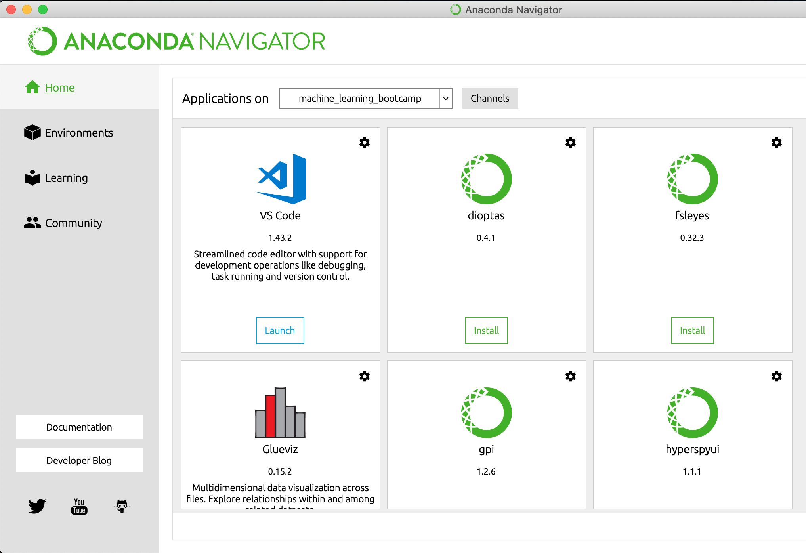
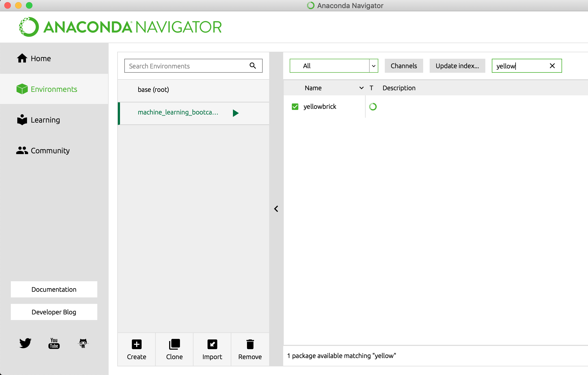

# Machine Learning Bootcamp

1. Install [Anaconda Navigator](https://docs.anaconda.com/anaconda/navigator/)

Launch Anaconda Navigator and click on the "Channels" button.



2. Add channels

Then click "Add..", and type in "conda-forge" and "districtdatalabs." Save by clicking "Update Channels."




3. Install packages

Switch the dropdown menu to "All." Search for "yellowbrick" and "imbalanced-learn", and check the boxes next to them. Finally click the apply button at the bottom of the screen to install.



